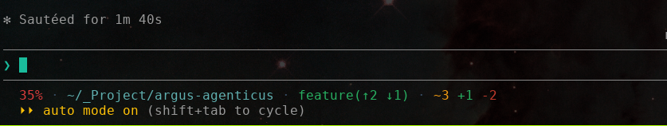
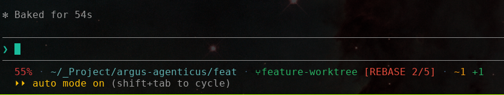
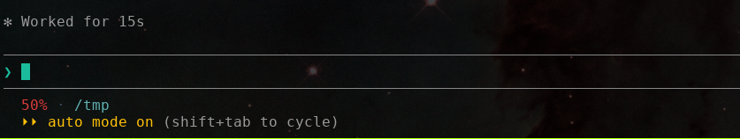
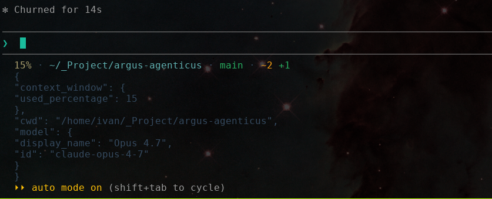

# statusline

Minimal, fast, extensible Claude Code statusline. Single Rust binary, ~5 ms per invocation, no runtime deps, new segment in 3 touch-points.

<table>
  <tr>
    <td></td>
    <td></td>
  </tr>
  <tr>
    <td></td>
    <td></td>
  </tr>
</table>

## cheat sheet

Codex-inspired: dim middot separator, soft teal cwd, gradient percentage, green branch, bright-red git state. Outside a git repo only context and cwd render.

| segment | colour | example | notes |
|---|---|---|---|
| context | grey → yellow → red gradient | `42%` | dim grey under 20%, then ramps |
| cache | grey → yellow → red gradient | `cache 4m32s`, `cache cold` | Anthropic prompt-cache TTL countdown; once cold the colour shifts by `context_window` % (cheap when context is empty, expensive when full) |
| 5h limit | green / yellow / red | `5h 42%` | Claude.ai rolling 5-hour usage; green <50%, yellow 50–80%, red >80%. Absent on API plans and before the first response |
| 7d limit | green / yellow / red | `7d 65%` | Claude.ai weekly usage; same thresholds as 5h |
| cwd | soft teal `#5fafaf` | `~/proj` | `$HOME` shortened to `~` |
| git branch | green | `main`, `⑂feature` | `⑂` only inside a worktree (resolved by reading `.git` gitfile, no fork) |
| git state | bright red | `[REBASE 2/5]` | `MERGE`, `REBASE n/m`, `CHERRY-PICK`, `REVERT`, `BISECT`, `AM n/m` — only during the op |
| ahead/behind | branch colour | `(↑2 ↓1)` | only when non-zero |
| diff | yellow / green / red | `~2 +1 -1` | modified tracked / untracked / deleted |
| idle time | bright black | `idle 3m12s` | since the last real user input in the Claude transcript |
| separator | bright black | ` · ` | middot |

## install

Downloads the right prebuilt binary, drops it in `~/.claude/bin/statusline` (or `%USERPROFILE%\.claude\bin\statusline.exe` on Windows), and patches `settings.json` so Claude Code picks it up.

**Linux / macOS:**

```sh
curl -fsSL https://raw.githubusercontent.com/Darkwing4/statusline-rs-cc/main/install.sh | sh
```

**Windows (PowerShell):**

```powershell
powershell -NoProfile -ExecutionPolicy Bypass -Command "iwr -useb https://raw.githubusercontent.com/Darkwing4/statusline-rs-cc/main/install.ps1 | iex"
```

Supported targets: Linux x86_64 / aarch64, macOS x86_64 / aarch64, Windows x86_64 / aarch64.

<details>
<summary>env vars, settings patch, build from source</summary>

| var | default |
|---|---|
| `STATUSLINE_TAG` | `latest` |
| `STATUSLINE_INSTALL_DIR` | `$HOME/.claude/bin` |
| `STATUSLINE_SETTINGS` | `$HOME/.claude/settings.json` |
| `STATUSLINE_SKIP_SETTINGS` | unset — set to `1` to skip the JSON patch |
| `STATUSLINE_REPO` | `Darkwing4/statusline-rs-cc` |

The settings patch is non-destructive: preserves every other key in `settings.json`, writes a `.bak` next to the original, no-ops if already pointed at the binary. If `python3` is missing it skips the patch and prints the snippet to paste manually.

Build from source:

```sh
cargo build --release
cp target/release/statusline ~/.claude/bin/statusline
```

</details>

## configuration

The whole config is a literal `Renderer { ... }` in [`src/main.rs`](src/main.rs):

```rust
let renderer = Renderer {
    separator: " · ",
    separator_color: Color::Named(90),
    segments: vec![
        Box::new(Context { color: Color::Gradient, prefix: "", prefix_color: Color::Rgb(180, 142, 173), suffix: "", suffix_color: Color::Rgb(180, 142, 173) }),
        Box::new(RateLimit { window: Window::FiveHour, prefix: "5h ", low_color: Color::Named(32), mid_color: Color::Named(33), high_color: Color::Named(31) }),
        Box::new(RateLimit { window: Window::SevenDay, prefix: "7d ", low_color: Color::Named(32), mid_color: Color::Named(33), high_color: Color::Named(31) }),
        Box::new(Cwd { color: Color::Rgb(95, 175, 175) }),
        Box::new(GitBranch { color: Color::Named(32), state_color: Color::Named(91), show_worktree: true, show_ahead_behind: true, show_state: true }),
        Box::new(GitDiff { modified_color: Color::Named(33), untracked_color: Color::Named(32), deleted_color: Color::Named(31) }),
        Box::new(IdleTime::new(Color::Named(90), "idle ", 0)),
    ],
};
```

Reorder, drop, or re-colour by editing the vec. `Color` variants: `Named(code)` for ANSI 30–37 / 90–97, `Rgb(r, g, b)` for truecolor, `Gradient` (only meaningful on `Context`).

## extending

Define the logic in `src/segments/*.rs`, register the module in `src/segments.rs`, initialize it in `src/main.rs`, then build.

`IdleTime` is the concrete extension example, added in [`fac22e1`](https://github.com/Darkwing4/statusline-rs-cc/commit/fac22e1c1b04822b332c00268305bfc9224547b1). It reads `transcript_path`, ignores tool-result messages, finds the latest real user input timestamp, and renders values like `idle 42s`, `idle 3m12s`, or `idle 1h0m`.

To make `IdleTime` tick without new Claude events, opt in with `statusLine.refreshInterval` in Claude Code settings.

Register it with `pub mod idle_time;` in `src/segments.rs`, then initialize it in `src/main.rs`:

```rust
use segments::idle_time::IdleTime;

Box::new(IdleTime::new(Color::Named(90), "idle ", 0))
```

Segments receive the raw `serde_json::Value` so they own which fields they read — no central schema to update. For git-aware segments take `git: &mut GitCache` and call `git.dir()` / `git.status()` — `git status` is forked at most once per render, shared. For segments that render on their own line below the main one (multi-line debug output), override `fn standalone(&self) -> bool { true }`.

<details>
<summary>source layout</summary>

```
src/
├── main.rs                 entry: build Renderer, write to stdout
├── statusline_renderer.rs  owns segments, joins them, truncates to terminal width
├── statusline_input.rs     reads + parses stdin JSON from Claude Code
├── types.rs / types/       shared types (Color, RESET)
└── segments/
    ├── context.rs          context window % with gradient
    ├── cwd.rs              shortened cwd
    ├── idle_time.rs        time since last real user input
    ├── git/
    │   ├── tools.rs        GitCache shared by branch + diff (one git status fork)
    │   ├── branch.rs       branch name, worktree marker, state, ahead/behind
    │   └── diff.rs         ~N +N -N counts
    └── debug/              gated behind cfg(debug_assertions), see Debug below
```

</details>

## debug

The `InputFromClaudeToStatusline` segment pretty-prints the raw stdin JSON on its own line below the main statusline, dim grey (see screenshot above). Useful for watching the contract live while iterating. Gated by `#[cfg(debug_assertions)]` — compiles away to zero bytes in `--release`.

`cache_ttl_dump` appends one JSONL line per render to `~/.claude/statusline-cache-ttl-debug.jsonl` with the parsed snapshot (`last_activity`, `ttl_secs`, derived `remaining`), the transcript path with its size/mtime, and the rendered text. Lets you scrub history when the timer stalls — compare consecutive entries to see whether the file grew, whether parsing latched onto a fresh row, and how `remaining` evolved. Same `cfg(debug_assertions)` gate.

```sh
cargo build && cp target/debug/statusline ~/.claude/bin/statusline                # poke around
cargo build --release && cp target/release/statusline ~/.claude/bin/statusline    # back to prod
```

## under the hood

Claude Code invokes the statusline after each assistant message (and a few other events), feeds JSON on stdin, renders whatever lands on stdout. Execution is async — a slow statusline never blocks input, in-flight runs are cancelled on update. Contract:

```json
{ "cwd": "...", "context_window": { "used_percentage": 42.5 }, "model": {...}, "workspace": {...} }
```

Hot path on Linux x86_64 (i7-12700H, median of 60): **~4.9 ms** inside a git repo, **~2.1 ms** outside, **~424 KB** stripped release binary. `git status --branch --porcelain=v2` forks once; everything else (HOME shortening, `.git` ancestor walk, state detection, terminal width via `stty`) runs in-process.

## license

MIT
