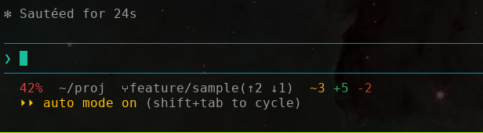
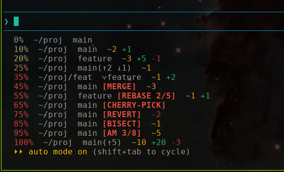

# statusline

Minimal, fast Claude Code statusline. Single Rust binary, ~3 ms per invocation, no runtime deps.



## cheat sheet



Each row above is one rendered statusline at a different context-window usage and git state. Reading top to bottom:

| row | what it shows |
|---|---|
| `0%   ~/proj  main` | clean repo, no diff against `HEAD`, no upstream divergence |
| `10%  ~/proj  main  ~2 +1` | 2 modified tracked files, 1 untracked |
| `20%  ~/proj  feature  ~3 +5 -1` | on `feature`, with modified / untracked / deleted counts |
| `25%  ~/proj  main(↑2 ↓1)  ~1` | 2 ahead, 1 behind upstream |
| `35%  ~/proj/feat  ⑂feature  ~1 +2` | git worktree (`⑂` prefix) checked out at `feature` |
| `45%  ~/proj  main [MERGE]  ~3` | merge in progress |
| `55%  ~/proj  feature [REBASE 2/5]  ~1 +1` | rebase, step 2 of 5 |
| `65%  ~/proj  main [CHERRY-PICK]` | cherry-pick in progress |
| `75%  ~/proj  main [REVERT]  -2` | revert in progress |
| `85%  ~/proj  main [BISECT]  ~1` | bisect in progress |
| `95%  ~/proj  main [AM 3/8]  -5` | `git am`, patch 3 of 8 |
| `100% ~/proj  main(↑5)  ~10 +20 -3` | high usage colour, plus full divergence + diff line |

Element-by-element:

| segment | meaning |
|---|---|
| `NN%` | context window usage; colour interpolates from dim grey (0%) through warm yellow (~20%) to red (30%+) |
| `~/proj` | current directory, `$HOME` shortened to `~` |
| `main`, `feature` | git branch (current `HEAD`) |
| `⑂` | prefix appears only inside a git worktree |
| `[MERGE]`, `[REBASE n/m]`, `[CHERRY-PICK]`, `[REVERT]`, `[BISECT]`, `[AM n/m]` | red, only while the corresponding operation is in progress; rebase/am include `done/total` progress |
| `(↑n ↓m)` | ahead/behind upstream |
| `~N` | modified tracked files (yellow) |
| `+N` | untracked files (green) |
| `-N` | deleted files (red) |

Outside a git repo only `%` and cwd are shown. Worktree gitfiles (`/.git/worktrees/<name>`) are resolved without forking `git`.

## install

One command. Downloads the right prebuilt binary for your platform, drops it in `~/.claude/bin/statusline` (or `%USERPROFILE%\.claude\bin\statusline.exe` on Windows), and patches `settings.json` so Claude Code picks it up on the next event.

**Linux / macOS:**

```sh
curl -fsSL https://raw.githubusercontent.com/Darkwing4/statusline-rs-cc/main/install.sh | sh
```

**Windows (PowerShell):**

```powershell
powershell -NoProfile -ExecutionPolicy Bypass -Command "iwr -useb https://raw.githubusercontent.com/Darkwing4/statusline-rs-cc/main/install.ps1 | iex"
```

Supported targets: Linux x86_64 / aarch64, macOS x86_64 / aarch64, Windows x86_64 / aarch64.

The settings patch is non-destructive: it preserves every other key in `settings.json`, writes a `.bak` next to the original before changing anything, and is a no-op if the file already points at the binary. If `python3` is missing it skips the patch and prints the snippet to paste manually.

Env vars the installer respects:

| var | default |
|---|---|
| `STATUSLINE_TAG` | `latest` |
| `STATUSLINE_INSTALL_DIR` | `$HOME/.claude/bin` |
| `STATUSLINE_SETTINGS` | `$HOME/.claude/settings.json` |
| `STATUSLINE_SKIP_SETTINGS` | unset — set to `1` to skip the JSON patch |
| `STATUSLINE_REPO` | `Darkwing4/statusline-rs-cc` |

### build from source

```sh
cargo build --release
```

The binary lands in `target/release/statusline`. Point `settings.json` at it the same way.

## performance

Median of 60 randomised runs on Linux x86_64:

| scenario | time |
|---|---|
| inside git repo | ~3.2 ms |
| outside git repo | ~0.8 ms |

The hot path forks `git status --branch --porcelain=v2` once and parses its output inline. Everything else (HOME shortening, ancestor walk for `.git`, state detection, terminal width) runs in-process.

## how it works

Claude Code invokes the statusline command after each assistant message and a few other events, feeding it JSON on stdin and rendering whatever the command writes to stdout. The execution is asynchronous: a slow statusline never blocks input, but in-flight runs are cancelled when a new update fires.

This binary reads:

```json
{ "cwd": "...", "context_window": { "used_percentage": 42.5 } }
```

…and writes one ANSI-coloured line back. That is the entire contract.

## license

MIT
