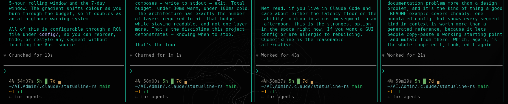
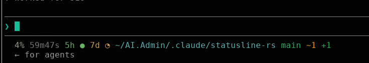
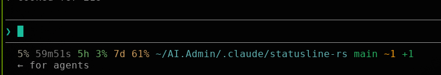
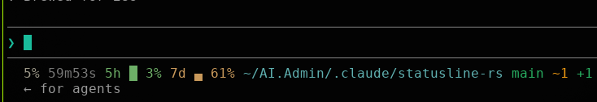

# statusline

The fastest Claude Code statusline: a single Rust binary, ~5 ms per render, zero runtime deps. Edit the config yourself, or ask Claude Code to do it — a bundled skill rewrites the RON, rebuilds, and reinstalls in one step.

<table>
  <tr>
    <td></td>
    <td></td>
  </tr>
  <tr>
    <td></td>
    <td></td>
  </tr>
</table>

When the line is wider than the terminal, the renderer wraps it across multiple lines instead of truncating:

<p></p>

Every segment is tweakable from the RON config, and some ship with multiple styles. For example, `RateLimit` has radial dial, bar, and plain percent (plus `BarPercent` / `RadialPercent` which combine a graphic with the number):

<table>
  <tr>
    <td></td>
    <td></td>
    <td></td>
  </tr>
</table>

<details>
<summary>cheat sheet — non-obvious bits</summary>

- `cache 4m32s` is the Anthropic prompt-cache TTL countdown. Once `cache cold`, the colour ramps by `context_window` % — cheap when context is empty, expensive when full.
- `5h` / `7d` are Claude.ai rolling usage limits: green <50%, yellow 50–80%, red >80%. Absent on API plans and before the first response.
- `⑂feature` means you're inside a git worktree (resolved by reading `.git`, no `fork()`).
- git state like `[REBASE 2/5]` only shows during the op (`MERGE`, `CHERRY-PICK`, `REVERT`, `BISECT`, `AM n/m`).
- diff `~2 +1 -1` = modified tracked / untracked / deleted.

</details>

## install

Downloads the right prebuilt binary, drops it in `~/.claude/bin/statusline` (or `%USERPROFILE%\.claude\bin\statusline.exe` on Windows), and patches `settings.json` so Claude Code picks it up.

**Linux / macOS:**

```sh
curl -fsSL https://raw.githubusercontent.com/Darkwing4/statusline-rs-cc/main/install.sh | sh
```

**Windows (PowerShell):**

```powershell
powershell -NoProfile -ExecutionPolicy Bypass -Command "iwr -useb https://raw.githubusercontent.com/Darkwing4/statusline-rs-cc/main/install.ps1 | iex"
```

Supported targets: Linux x86_64 / aarch64, macOS x86_64 / aarch64, Windows x86_64 / aarch64.

<details>
<summary>env vars, settings patch, build from source</summary>

| var | default |
|---|---|
| `STATUSLINE_TAG` | `latest` |
| `STATUSLINE_INSTALL_DIR` | `$HOME/.claude/bin` |
| `STATUSLINE_SETTINGS` | `$HOME/.claude/settings.json` |
| `STATUSLINE_SKIP_SETTINGS` | unset — set to `1` to skip the JSON patch |
| `STATUSLINE_REPO` | `Darkwing4/statusline-rs-cc` |

The settings patch is non-destructive: preserves every other key in `settings.json`, writes a `.bak` next to the original, no-ops if already pointed at the binary. If `python3` is missing it skips the patch and prints the snippet to paste manually.

Build from source:

```sh
cargo build --release
cp target/release/statusline ~/.claude/bin/statusline
```

</details>

## claude code skill

Ships with a project-local skill at [`.claude/skills/statusline-config/`](.claude/skills/statusline-config/SKILL.md). Open Claude Code in the cloned repo and it auto-discovers it — then ask in plain language and Claude edits the RON, rebuilds, and copies the binary into place:

> recolour the branch to lavender
> make 5h radial
> drop the 7d segment

The skill defaults to editing `config/local.ron` (gitignored personal override) and runs `./install-local.sh` to reinstall. Say "for the repo" to edit `config/default.ron` instead.

## configuration

The whole config is an external [RON](https://github.com/ron-rs/ron) file at [`config/default.ron`](config/default.ron). `build.rs` embeds it into the binary at compile time; [`src/config.rs`](src/config.rs) parses it into segments at startup. Point `STATUSLINE_CONFIG` at a different file to swap the embedded config without touching the source — `install-local.sh` auto-picks `config/local.ron` if it exists (gitignored personal override).

```ron
(
    separator: " ",
    separator_color: Named(90),
    segments: [
        Model(
            color: Rgb(180, 142, 173),
            prefix: "",
        ),
        Effort(
            color: Named(90),
            prefix: "",
        ),
        Context(
            color: Gradient,
            prefix: "", prefix_color: Rgb(180, 142, 173),
            suffix: "", suffix_color: Rgb(180, 142, 173),
        ),
        CacheTtl(color: Gradient, prefix: "cache "),
        RateLimit(
            window: FiveHour, style: Bar, fill: Remaining, color_mode: Gradient,
            prefix: "5h ",
            low_color:  Rgb(103, 175, 103),
            mid_color:  Rgb(195, 179, 100),
            high_color: Rgb(220,  60,  60),
        ),
        RateLimit(
            window: SevenDay, style: Bar, fill: Remaining, color_mode: Gradient,
            prefix: "7d ",
            low_color:  Rgb(103, 175, 103),
            mid_color:  Rgb(195, 179, 100),
            high_color: Rgb(220,  60,  60),
        ),
        Cwd(color: Rgb(95, 175, 175)),
        GitBranch(
            color: Named(32), state_color: Named(91),
            show_worktree: true, show_ahead_behind: true, show_state: true,
        ),
        GitDiff(
            modified_color:  Named(33),
            untracked_color: Named(32),
            deleted_color:   Named(31),
        ),
        GitError(color: Named(91), text: "no git"),
    ],
)
```

Reorder, drop, or re-colour by editing the list, then rebuild. `Color` variants: `Named(code)` for ANSI 30–37 / 90–97, `Rgb(r, g, b)` for truecolor, `Gradient` (meaningful on `Context`, `CacheTtl`, and `RateLimit` when `color_mode: Gradient`).

## extending

Define the logic in `src/segments/*.rs`, register the module in `src/segments.rs`, initialize it in `src/main.rs`, then build.

`IdleTime` is the concrete extension example, added in [`fac22e1`](https://github.com/Darkwing4/statusline-rs-cc/commit/fac22e1c1b04822b332c00268305bfc9224547b1). It reads `transcript_path`, ignores tool-result messages, finds the latest real user input timestamp, and renders values like `idle 42s`, `idle 3m12s`, or `idle 1h0m`.

To make `IdleTime` tick without new Claude events, opt in with `statusLine.refreshInterval` in Claude Code settings.

Register it with `pub mod idle_time;` in `src/segments.rs`, then initialize it in `src/main.rs`:

```rust
use segments::idle_time::IdleTime;

Box::new(IdleTime::new(Color::Named(90), "idle ", 0))
```

Segments receive the raw `serde_json::Value` so they own which fields they read — no central schema to update. For git-aware segments take `git: &mut GitCache` and call `git.dir()` / `git.status()` — `git status` is forked at most once per render, shared. For segments that render on their own line below the main one (multi-line debug output), override `fn standalone(&self) -> bool { true }`.

<details>
<summary>source layout</summary>

```
src/
├── main.rs                 entry: build Renderer, write to stdout
├── statusline_renderer.rs  owns segments, joins them, truncates to terminal width
├── statusline_input.rs     reads + parses stdin JSON from Claude Code
├── types.rs / types/       shared types (Color, RESET)
└── segments/
    ├── model.rs            current model name
    ├── effort.rs           current reasoning effort level
    ├── context.rs          context window % with gradient
    ├── cwd.rs              shortened cwd
    ├── idle_time.rs        time since last real user input
    ├── git/
    │   ├── tools.rs        GitCache shared by branch + diff (one git status fork)
    │   ├── branch.rs       branch name, worktree marker, state, ahead/behind
    │   └── diff.rs         ~N +N -N counts
    └── debug/              gated behind cfg(debug_assertions), see Debug below
```

</details>

## under the hood

Claude Code invokes the statusline after each assistant message (and a few other events), feeds JSON on stdin, renders whatever lands on stdout. Execution is async — a slow statusline never blocks input, in-flight runs are cancelled on update. Contract:

```json
{ "cwd": "...", "context_window": { "used_percentage": 42.5 }, "model": { "display_name": "Opus" }, "effort": { "level": "high" }, "workspace": {...} }
```

Hot path on Linux x86_64 (i7-12700H, median of 60): **~4.9 ms** inside a git repo, **~2.1 ms** outside, **~424 KB** stripped release binary. `git status --branch --porcelain=v2` forks once; everything else (HOME shortening, `.git` ancestor walk, state detection, terminal width via `stty`) runs in-process.

## license

MIT
