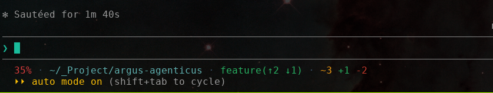
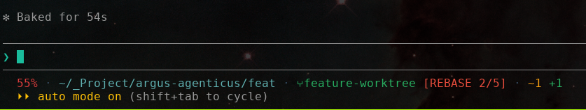
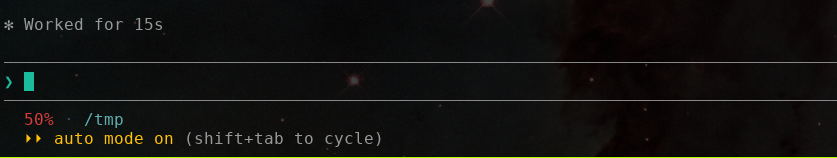
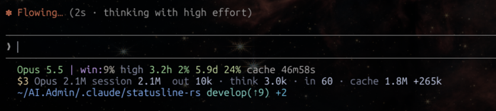
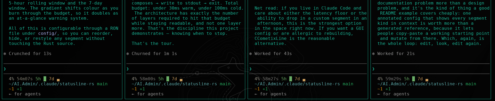
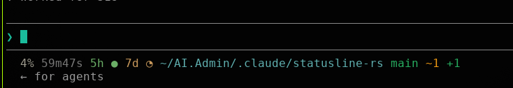
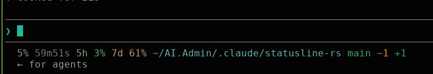
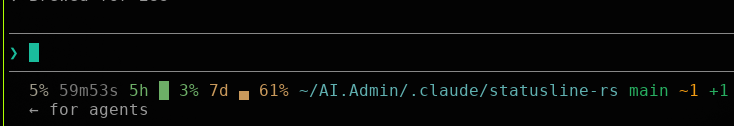

# statusline

**[Build your line →](https://darkwing4.github.io/statusline-rs-cc/)**

A status line for Claude Code. I wrote it after failing to find one on GitHub that was simple, fast, and easy for me to understand: one Rust binary, about 5 ms per render.

<table>
  <tr>
    <td></td>
    <td></td>
  </tr>
  <tr>
    <td></td>
    <td></td>
  </tr>
</table>

<p></p>

<table>
  <tr>
    <td></td>
    <td></td>
    <td></td>
  </tr>
</table>

## install

1. Assemble the line in the [builder](https://darkwing4.github.io/statusline-rs-cc/) and run the install command it gives you.

2. Or clone this repo and ask Claude Code to set it up: the bundled [skill](.claude/skills/statusline-config/SKILL.md) edits the RON config and installs the binary. Without Claude Code, run the script: it installs the default line, and a copy of [`config/default.ron`](config/default.ron) at `~/.claude/statusline/config.ron` is yours to edit by hand.

   ```sh
   curl -fsSL https://raw.githubusercontent.com/Darkwing4/statusline-rs-cc/main/install.sh | sh
   ```

   Windows (PowerShell):

   ```powershell
   powershell -NoProfile -ExecutionPolicy Bypass -Command "iwr -useb https://raw.githubusercontent.com/Darkwing4/statusline-rs-cc/main/install.ps1 | iex"
   ```

## license

MIT
